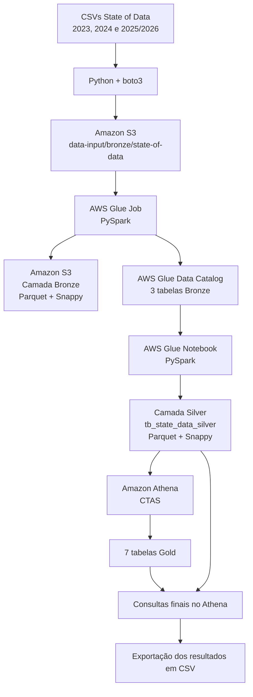

# Tech Challenge Fase 3 — Big Data & Analytics

## Grupo 7

- Camila de Oliveira — RM 371409
- Lucas Zucoloto Soares Valbusa — RM 373425
- Luyza Brito de Paiva Lima — RM 373813
- Tatiana Regina da Silva — RM 373518
- Vanessa Gomes Cardoso — RM 373426

## Sobre o projeto

Este projeto foi desenvolvido para o **Tech Challenge — Fase 3 de Big Data & Analytics**.

O objetivo é construir uma solução analítica em ambiente AWS utilizando as três pesquisas mais recentes do **State of Data Brasil** disponíveis para o projeto:

- 2023
- 2024
- 2025/2026

A solução organiza os dados em uma arquitetura de camadas **Bronze, Silver e Gold**, utilizando serviços AWS para ingestão, processamento, catalogação e consulta analítica.

Fonte dos dados: [Data Hackers — Kaggle](https://www.kaggle.com/datahackers/datasets)

---

## Arquitetura do pipeline



### Fluxo resumido

1. Os arquivos CSV originais são enviados para o Amazon S3 com Python e `boto3`.
2. Um AWS Glue Job em PySpark lê os CSVs, normaliza tecnicamente os nomes das colunas e grava a camada Bronze em Parquet com compressão Snappy.
3. O Glue Job atualiza o AWS Glue Data Catalog com as três tabelas Bronze.
4. Um Glue Notebook em PySpark lê as tabelas Bronze pelo catálogo, harmoniza os diferentes anos, realiza tratamentos de qualidade e grava a tabela Silver.
5. O Amazon Athena cria sete tabelas analíticas da camada Gold por meio de `CREATE TABLE AS SELECT` (CTAS).
6. Consultas finais no Athena são utilizadas para exportar os resultados analíticos em CSV.

---

## Tecnologias utilizadas

- Amazon S3
- AWS Glue Job
- AWS Glue Data Catalog
- AWS Glue Notebook / Interactive Session
- Amazon Athena
- Apache Spark / PySpark
- Python
- boto3
- SQL
- Parquet
- Snappy
- Jupyter Notebook

---

## Estrutura atual do repositório

```text
tech_challenge_fase_3-1/
│
├── _01_data_input/
│   └── kaggle/
│       ├── Final Dataset - State of Data 2024 - Kaggle - df_survey_2024.csv
│       ├── Final Dataset - State of Data 2025-2026 - Kaggle.csv
│       └── State_of_data_BR_2023_Kaggle - df_survey_2023.csv
│
├── _02_notebooks/
│   ├── _glue-state-of-data-bronze.json
│   ├── _glue-state-of-data-silver.ipynb
│   ├── glue-state-of-data-bronze.py
│   └── state_of_data_upload_bronze.ipynb
│
├── _03_script/
│   ├── athena_state_of_data_gold_criacao.sql
│   └── athena_state_of_data_selects_csv.sql
│
├── _04_athena_outputs/
│   ├── 01_diversidade_genero.csv
│   ├── 02_perfil_profissional.csv
│   ├── 03_remuneracao.csv
│   ├── 04_regiao.csv
│   ├── 05_modelo_trabalho.csv
│   ├── 06_tecnologias.csv
│   ├── 07_inteligencia_artificial.csv
│   └── 08_base_consolidada.csv
│
├── _05_arquitetura/
│   ├── Arquitetura_AWS_gold_via_athena.drawio
│   └── arquitetura_pipeline_real.png
│
├── _06_material_executivo/
│   ├── material_executivo_v3_dataviz_real.pptx
│   └── Perfil_de_Mercado_fonte_BI.pptx
│
├── .gitignore
├── README.md
└── requirements.txt
```

### Organização das pastas

- `_01_data_input`: bases originais do State of Data utilizadas no projeto.
- `_02_notebooks`: notebooks e scripts responsáveis pelas camadas Bronze e Silver.
- `_03_script`: scripts SQL utilizados no Amazon Athena para criação e consulta da camada Gold.
- `_04_athena_outputs`: resultados das consultas executadas no Athena e exportados em CSV.
- `_05_arquitetura`: diagrama editável da arquitetura AWS e sua versão em imagem.
- `_06_material_executivo`: apresentações utilizadas como material executivo e fonte de DataViz.

---

## Licença e uso dos dados

Os dados utilizados neste projeto têm origem nos datasets públicos do **State of Data Brasil / Data Hackers**, disponibilizados no Kaggle.

Este repositório foi desenvolvido para fins acadêmicos do Tech Challenge.


